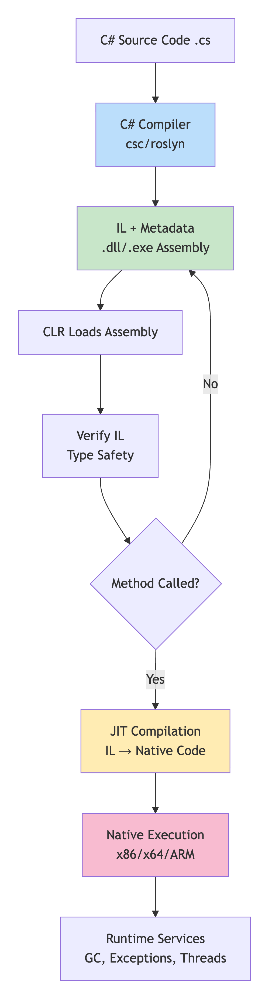
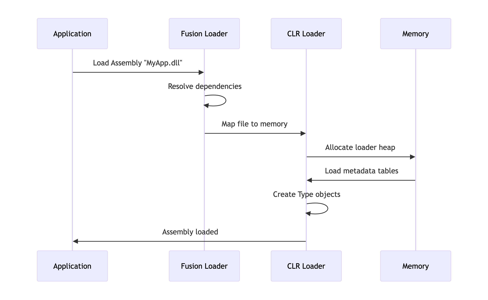

# 1.10 Compilation & Execution Model

## .NET Compilation & Execution Model

### 🔄 **End-to-End Pipeline: C# to Execution**

<figure><figcaption></figcaption></figure>

### 📦 **Assembly Structure (PE Format)**

```markdown
Assembly (.dll/.exe)
┌─────────────────────────────────────────┐
│ DOS Header                              │
│ PE Header                               │
├─────────────────────────────────────────┤
│ .text Section ← IL CODE HERE            │
│ .rsrc Section ← Resources               │
│ .reloc Section ← Relocations            │
├─────────────────────────────────────────┤
│ CLR Header                              │
│ • Runtime version                       │
│ • Entry point token                     │
│ • Strong name signature                 │
├─────────────────────────────────────────┤
│ METADATA ← TYPE INFORMATION             │
│ • Tables (TypeDef, MethodDef, etc.)     │
│ • Blob heap (signatures)                │
│ • String heap (names)                   │
│ • GUID heap                             │
│ • User string heap                      │
└─────────────────────────────────────────┘
```

### 🔍 **Metadata: The Type Database**

#### **Metadata Tables (ECMA-335)**

```
Key Tables (Each is an array of rows):
#0  Module          ← Assembly info
#1  TypeRef         ← Referenced types  
#2  TypeDef         ← Defined types
#3  Field           ← Fields
#4  MethodDef       ← Methods
#5  Param           ← Parameters
#23 AssemblyRef     ← Referenced assemblies

Token Format: 0xTTXXXXXX
0x02 = TypeDef table (TT=02)
000003 = Row 3 (XXXXXX=000003)
→ Token: 0x02000003 = TypeDef row 3
```

#### **Metadata in Action**

```
public class Calculator  // TypeDef row
{
    public int Add(int a, int b)  // MethodDef row
    {
        return a + b;  // IL code in .text section
    }
}

// Metadata tables store:
// - Calculator extends System.Object
// - Add method signature: int (int, int)
// - Parameter names: a, b
// - Method IL location (RVA: 0x2050)
```

### ⚡ **IL (Intermediate Language): The .NET Bytecode**

#### **Why IL Matters: 3 Key Reasons**

<pre><code>1. <a data-footnote-ref href="#user-content-fn-1">LANGUAGE INTEROP</a>: All .NET languages compile to IL
   C# → IL, F# → IL, VB.NET → IL

2. <a data-footnote-ref href="#user-content-fn-1">PLATFORM INDEPENDENCE</a>: IL is CPU-agnostic
   Same IL runs on x86, x64, ARM

3. JIT OPTIMIZATION: Compile-time + runtime optimization
   JIT can optimize based on actual usage
</code></pre>

#### **IL Example: Simple Method**

```csharp
// C# Source:
public int Add(int a, int b) => a + b;

// IL Compiled:
.method public hidebysig instance int32 
        Add(int32 a, int32 b) cil managed
{
  .maxstack 2
  .locals init (int32 V_0)
  
  IL_0000: ldarg.1      // Load parameter a
  IL_0001: ldarg.2      // Load parameter b  
  IL_0002: add          // Add them
  IL_0003: stloc.0      // Store to local 0
  IL_0004: br.s IL_0006 // Branch to return
  
  IL_0006: ldloc.0      // Load result
  IL_0007: ret          // Return
}
```

### 🚀 **Execution Flow: Step by Step**

#### **1. Compilation (C# → IL)**

```csharp
C# Code → Roslyn Compiler → IL + Metadata
• Syntax tree → Lowering → IL generation
• All type info stored in metadata tables
• IL is stack-based (push/pop operations)
```

#### **2. Assembly Loading**

<figure><figcaption></figcaption></figure>

#### **3. JIT Compilation (On First Call)**

```
When: Method first called
Steps:
1. Find IL in .text section
2. Verify type safety
3. Convert to CPU instructions
4. Patch method table
5. Execute native code
```

### ⚡ **Key Performance Points**

#### **Metadata Advantages**

```
✅ NO HEADER FILES: Types self-describing
✅ REFLECTION: Runtime type inspection
✅ SERIALIZATION: Knows all type details  
✅ DEBUGGING: Symbol information
✅ VERSIONING: Assembly references
```

#### **IL Advantages Over Native**

```
✅ SMALLER: IL is compact
✅ VERIFIABLE: Can check safety before running
✅ PORTABLE: One binary for all platforms
✅ OPTIMIZABLE: JIT can specialize
```

### 🎯 **Quick Summary**

```
1. C# → IL: Roslyn compiles to stack-based bytecode
2. Assembly: PE file with IL + Metadata + Resources
3. Metadata: Database of all types (tables + heaps)
4. IL Matters: Enables language interop, JIT optimization, verification
5. Execution: IL → JIT → Native → Run
```

**Key Insight:** IL is the "universal language" that enables .NET's cross-language, cross-platform capabilities while metadata provides the rich type information needed for reflection, serialization, and tooling.

[^1]: 
