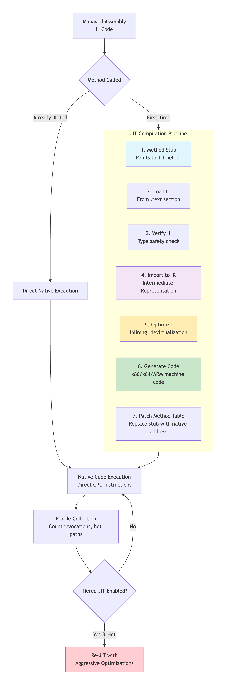
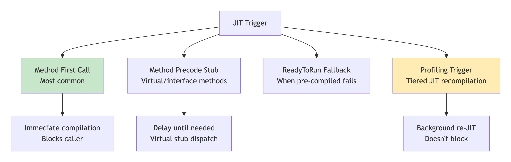
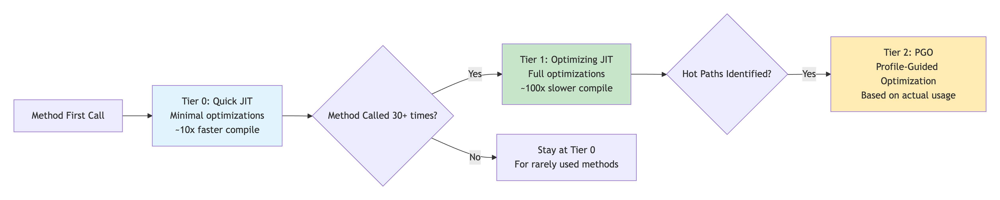

# 1.11 JIT Compilation

Just-In-Time compiler(JIT) is a part of [**Common Language Runtime (CLR)**](1.6-clr-common-language-runtime.md) in _.NET_ which is responsible for managing the execution of _.NET_ programs regardless of any _.NET_ programming language.&#x20;

A language-specific compiler **converts** the s**ource code** to the **intermediate language(IL)**. This intermediate language is then converted into the machine code by the Just-In-Time (**JIT**) compiler. This machine code is specific to the computer environment that the JIT compiler runs on. \
\
**Working of JIT Compiler:** The JIT compiler is required to speed up the code execution and provide support for multiple platforms. Its working is given as follows:&#x20;

<figure><figcaption></figcaption></figure>

### 🎯 **What JIT Does: IL → Native Code Transformer**

**JIT = Just-In-Time Compiler = Runtime IL to Machine Code Converter**

<figure><figcaption></figcaption></figure>

### ⏰ **When JIT Happens: Trigger Points**

#### **4 Trigger Conditions**

<figure><figcaption></figcaption></figure>

#### **Real Example: When JIT Kicks In**

```csharp
public class Program
{
    static void Main()
    {
        // JIT NOT YET: Main() not called
    }
    
    // On process start:
    // 1. CLR loads assembly
    // 2. Finds Main() method
    // 3. JIT compiles Main() ← FIRST JIT
    // 4. Executes Main()
    
    public void Process()
    {
        // JIT LATER: When called
        var helper = new Helper();
        helper.DoWork();  // JIT compiles DoWork() here
        helper.DoWork();  // Already JITted, direct call
    }
}
```

### ⚖️ **Startup vs Throughput: The JIT Trade-off**

#### **The Fundamental Dilemma**

```
STARTUP TIME: How fast app becomes usable
THROUGHPUT: How fast it runs after startup

FAST STARTUP = Minimal JIT, quick compilation
FAST THROUGHPUT = Aggressive optimization, slow compilation
```

#### **Tiered JIT Solution (.NET Core 3.0+)**

<figure><figcaption></figcaption></figure>

#### **Optimizations Applied at Each Tier**

```
TIER 0 (QUICK):
• Basic block ordering
• Simple inlining (tiny methods only)
• No loop optimizations
• Compile time: ~10 microseconds

TIER 1 (OPTIMIZING):
• Aggressive inlining
• Devirtualization
• Loop unrolling
• Bounds check elimination
• Dead code elimination
• Compile time: ~100-1000 microseconds

TIER 2 (PGO):
• Inlining based on actual call sites
• Virtual call devirtualization
• Branch prediction hints
• Cache-friendly layouts
```

### ⚡ **Why JIT Matters for Performance**

#### **3 Key Performance Advantages**

#### **Real Performance Impact**

```
// Without JIT Optimizations:
public int Calculate(int[] data)
{
    int sum = 0;
    for (int i = 0; i < data.Length; i++)  // Bounds check EACH iteration
    {
        sum += data[i];  // Array access with bounds check
    }
    return sum;
}

// With JIT Optimizations:
// 1. Bounds check hoisted OUT of loop (check once)
// 2. Loop unrolling (process 4 items per iteration)
// 3. SIMD instructions (SSE/AVX for parallel adds)
// 4. Register allocation (keep sum in CPU register)

// Result: 10-100x speedup for hot loops
```

### 🔧 **JIT Internals: How It Really Works**

#### **Method Table Before/After JIT**

<pre><code><strong>BEFORE JIT:
</strong>Method Table Entry for Add():
┌─────────────────────────┐
│ Address: 0x00007FF...   │
│ Points to: PRESTUB      │
│ (JIT helper function)   │
└─────────────────────────┘

DURING JIT:
Prestub called → JIT compiles → Updates table

AFTER JIT:
Method Table Entry for Add():
┌─────────────────────────┐
│ Address: 0x00007FF...   │
│ Points to: NATIVE CODE  │
│ (Generated machine code)│
└─────────────────────────┘
</code></pre>

#### **Inlining Example**

```csharp
// Original C#
public int Calculate(int x, int y)
{
    return Add(x, y) * 2;
}

private int Add(int a, int b)
{
    return a + b;
}

// JIT Inlined Version (pseudo assembly):
// Instead of: call Add → return * 2
// Becomes: 
//   mov eax, [x]   ; Load x
//   add eax, [y]   ; Add y
//   shl eax, 1     ; Multiply by 2 (shift left)
//   ret            ; Return
// Saves: Call overhead, stack setup, return
```

### ⚡ **JIT Configuration & Tuning**

#### **Environment Variables**

```bash
# Enable/Disable Tiered JIT
export COMPlus_TieredCompilation=1  # Default in .NET Core 3+
export COMPlus_TC_QuickJitForLoops=1  # JIT loops quickly

# JIT Optimization Level
export COMPlus_JitMinOpts=0  # Full optimizations (default)
export COMPlus_JitMinOpts=1  # Minimal optimizations (debug)

# ReadyToRun (Pre-compiled)
export COMPlus_ReadyToRun=1  # Use pre-JITted code if available
```

#### **ReadyToRun (Ahead-of-Time Compilation)**

```
R2R = Pre-JIT at build time
Benefits: Faster startup (no JIT cost)
Limits: Less optimization (no runtime profiling)
Used for: .NET Core framework libraries
```

### 📊 **JIT Performance Metrics**

#### **Compilation Costs**

```
Method Size vs Compile Time:
• Small method (10 IL bytes): ~1-10 μs
• Medium method (100 IL bytes): ~10-100 μs  
• Large method (1000+ IL bytes): ~100-1000 μs

Optimization Impact:
• Tier 0: 1x speed (baseline)
• Tier 1: 2-10x speed (after warmup)
• PGO: Additional 10-30% speedup
```

#### **When JIT Can Hurt Performance**

```
1. STARTUP-INTENSIVE APPS:
   • CLI tools (run once, exit)
   • Serverless functions
   • Solution: Use ReadyToRun or Native AOT

2. LARGE CODEBASES:
   • JIT memory overhead
   • Solution: Tiered compilation

3. DETERMINISTIC PERFORMANCE:
   • JIT introduces variance
   • Solution: NGEN or AOT
```

#### **Types of Just-In-Time Compiler:**&#x20;

There are **3** types of JIT compilers which are as follows:&#x20;

* **Pre-JIT Compiler:** All the source code is compiled into the machine code at the same time in a single compilation cycle using the Pre-JIT Compiler. This compilation process is performed at application deployment time. And this compiler is always implemented in the _**Ngen.exe (Native Image Generator)**_.&#x20;

<figure><figcaption></figcaption></figure>

* **Normal JIT Compiler:** The source code methods that are required at run-time are compiled into machine code the first time they are called by the Normal JIT Compiler. After that, they are stored in the cache and used whenever they are called again.&#x20;

<figure><figcaption></figcaption></figure>

**Econo JIT Compiler:** The source code methods that are required at run-time are compiled into machine code by the Econo JIT Compiler. After these methods are not required anymore, they are removed. This JIT compiler is obsolete starting from dotnet 2.0

<figure><figcaption></figcaption></figure>

### ✅ **Key Takeaways**

```
WHAT: JIT converts IL to native code at runtime
WHEN: On first method call + tiered recompilation
WHY: Enables runtime optimization based on actual usage
HOW: Multi-tier compilation balancing startup vs throughput

KEY INSIGHTS:
1. JIT enables CPU-specific optimizations
2. Tiered JIT balances startup/throughput
3. Inlining is the #1 optimization
4. Profile-guided optimization adapts to usage
5. ReadyToRun reduces startup cost
```

**Bottom Line:** JIT is why .NET can be both fast to start AND fast to run, adapting to your actual workload and hardware. It's the secret sauce that makes managed code performance competitive with native C++.
