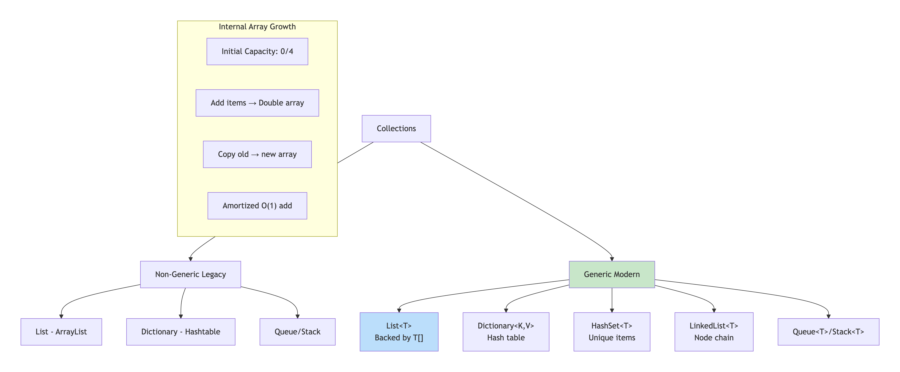
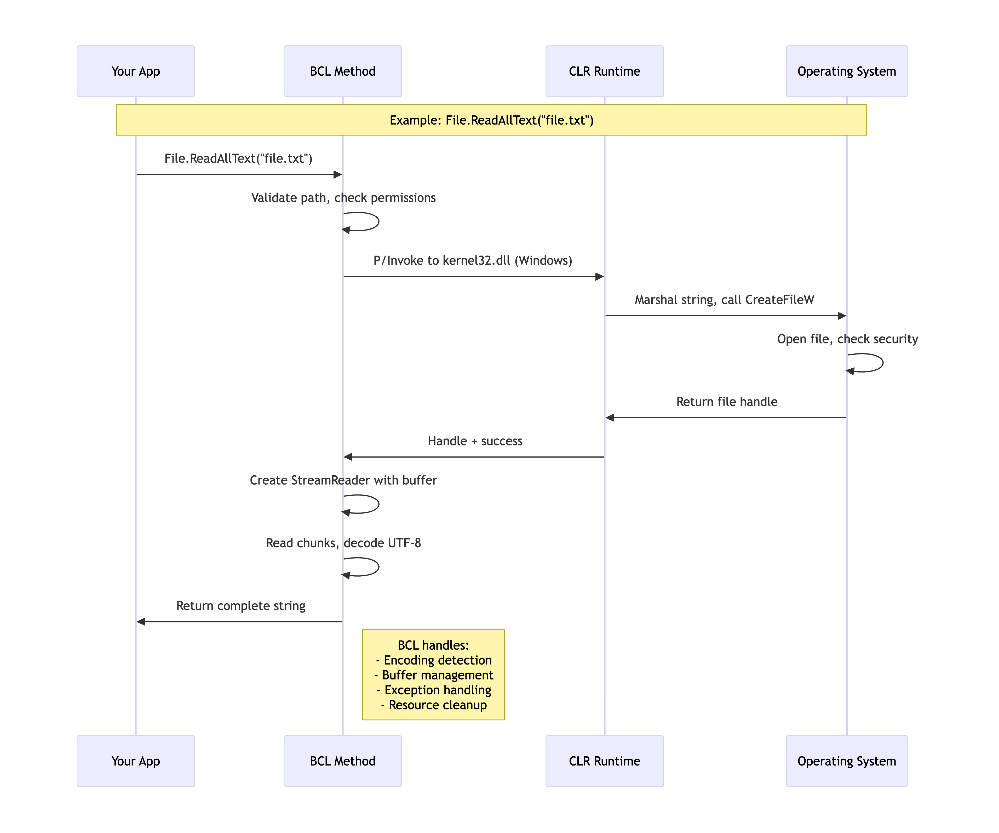
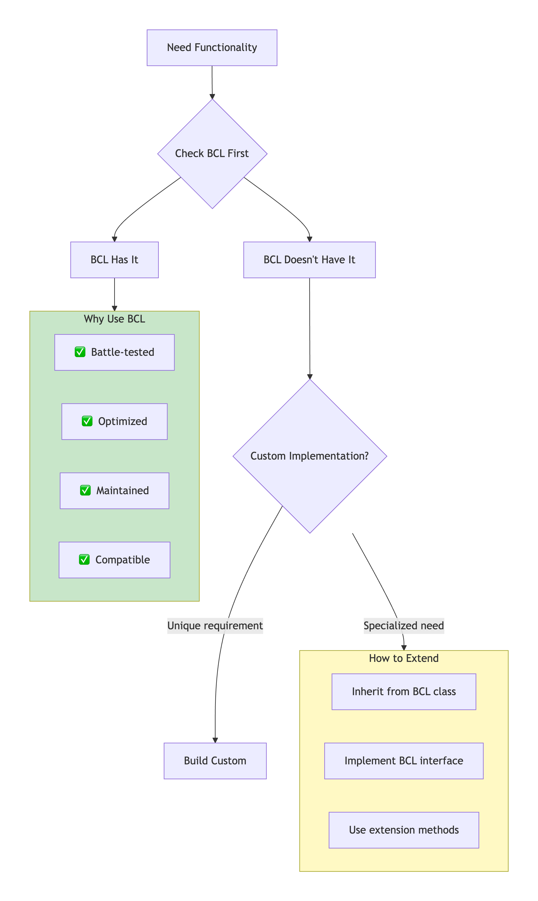
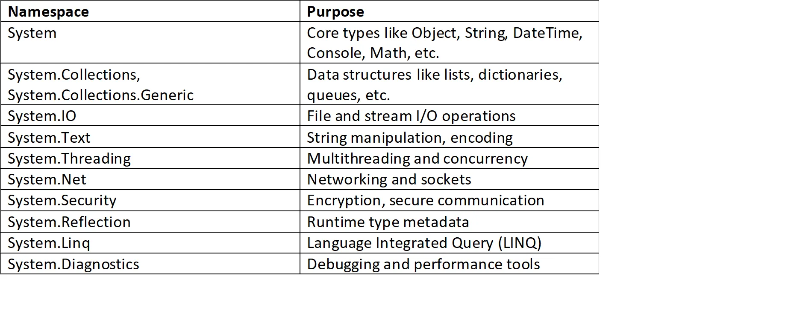

# BCL - Base Class Library

### 🎯 **What is BCL? The Essential Foundation**

The **Base Class Library (BCL)** is a core set of libraries in .NET that provides the fundamental building blocks for any .NET application.&#x20;

It contains classes, interfaces, and types that enable common programming tasks like:

File I/O, String manipulation, Collections, Networking, Data types, Security, Multithreading, Date and time handling.

These foundational types are consistent across different **.NET** implementations such as:

`.NET Core`

`.NET Framework`

`.NET 5/6/7+`

`Xamarin/.NET MAUI`

`Mono etc.`

### **Architecture and Structure** <a href="#ba33" id="ba33"></a>

The BCL is a subset of the Framework Class Library (FCL). Here’s a layered view of how they relate:

<figure><figcaption></figcaption></figure>

<figure><figcaption></figcaption></figure>

### 🔄 **BCL Internal Architecture: How It's Organized**

#### **BCL Layered Structure**

text

```
┌─────────────────────────────────────────────┐
│           YOUR APPLICATION CODE             │
├─────────────────────────────────────────────┤
│           FCL (Framework Class Library)     │
│           • ASP.NET Core                    │
│           • Entity Framework                │
│           • Windows Desktop APIs            │
├─────────────────────────────────────────────┤
│           BCL (Base Class Library)          │
│           • System.* namespaces             │
│           • Core data types & utilities     │
├─────────────────────────────────────────────┤
│           CoreCLR / Runtime                 │
│           • JIT Compiler                    │
│           • Garbage Collector               │
│           • Type System                     │
└─────────────────────────────────────────────┘
```

### 📦 **BCL Core Namespaces & What They Contain**

#### **1. System (The Absolute Essentials)**

```csharp
// These types are ALWAYS available

Object    // Root of everything
String    // Immutable text - most used type
Array     // Base for all arrays
ValueType // Base for all structs
Enum      // Base for all enums
Delegate  // Base for all delegates
Exception // Base for all exceptions
```

**Internal Fact:** <mark style="color:blue;">**`System.Object`**</mark> has only 4 virtual methods:

* `ToString()` - Default: returns type name
* `GetHashCode()` - Default: returns unique ID
* `Equals()` - Default: reference equality
* `Finalize()` - For garbage collection

#### **2. System.Collections & System.Collections.Generic**

<figure><figcaption></figcaption></figure>

#### **3.** [**System.IO**](https://system.io/) **(File & Stream Operations)**

```csharp
// BCL provides ABSTRACTIONS over OS file systems
public void ReadFile(string path)
{
    // All these are BCL abstractions
    if (File.Exists(path))           // Checks OS
    {
        using (var stream = File.OpenRead(path))  // OS file handle
        using (var reader = new StreamReader(stream))  // Text decoding
        {
            string content = reader.ReadToEnd();  // Buffered reading
        }
    }
}

// Internal Flow:
// Your Code → BCL → P/Invoke → Windows API/Linux syscalls → Disk
```

#### **4. System.Threading (Concurrency Primitives)**

<pre class="language-csharp"><code class="lang-csharp">Thread Pool Architecture:
┌─────────────────────────────────────────────┐
│ Global Queue                                │
│ • Work items wait here                      │
├─────────────────────────────────────────────┤
│ Worker Threads (Managed by CLR)             │
│ • Min threads = processor count             │
│ • Max threads = configurable                │
├─────────────────────────────────────────────┤
│ I/O Completion Ports                        │
│ • Async I/O operations                      │
└─────────────────────────────────────────────┘

<strong>Key Types:
</strong>- ThreadPool: Queue work, don't create threads manually
- ManualResetEvent/AutoResetEvent: Thread signaling
- Interlocked: Atomic operations
- Monitor (lock keyword): Mutual exclusion
</code></pre>

### ⚡ **Why You Should NEVER Reinvent BCL Primitives**

#### **Case Study: Implementing Your Own String Class**

```csharp
// ❌ BAD: Don't do this!
public class MyString
{
    private char[] _chars;
    
    public MyString(string value)
    {
        _chars = value.ToCharArray();
    }
    
    public int Length => _chars.Length;
    
    // Problem 1: Missing interning
    // Problem 2: No culture-aware comparison
    // Problem 3: Inefficient memory usage
    // Problem 4: No security considerations
    // Problem 5: Breaks framework compatibility
}

// ✅ GOOD: Use BCL's String
string text = "Hello World";
// Benefits:
// 1. String interning pool
// 2. Thread-safe (immutable)
// 3. Culture-aware operations
// 4. Optimized memory layout
// 5. Framework-wide compatibility
```

#### **Real Performance Comparison**

```csharp
public class Benchmark
{
    // BCL List<T> internal optimizations:
    // 1. Array doubling strategy
    // 2. SIMD operations for certain types
    // 3. Bounds check elimination
    // 4. Cache-friendly layout
    
    public void AddMillionItems()
    {
        // BCL List<int> - Optimized
        var bclList = new List<int>();
        for (int i = 0; i < 1_000_000; i++)
        {
            bclList.Add(i);  // Amortized O(1)
        }
        
        // Naive implementation - Slower
        var naiveList = new NaiveList<int>();
        for (int i = 0; i < 1_000_000; i++)
        {
            naiveList.Add(i);  // O(n) resize each time
        }
    }
}
```

### 🔧 **How BCL Works with the Runtime**

#### **BCL ↔ CLR Integration Points**

<figure><figcaption></figcaption></figure>

#### **BCL Types That Map to CLR Intrinsics**

```csharp
// Some BCL types have SPECIAL TREATMENT by CLR:

// 1. String - Immutable, interning support
string s = "hello";  // CLR: Special IL instruction ldstr

// 2. Array - Bounds checking, covariance
int[] arr = new int[10];  // CLR: Special newarr instruction

// 3. Delegate - Method binding
Action action = Method;  // CLR: Special ldftn instruction

// 4. Nullable<T> - Special boxing behavior
int? nullable = 42;  // CLR: Special unboxing support

// 5. TypedReference - Low-level type handling
// Used by __refvalue, __makeref C# keywords
```

### 📊 **BCL Version Evolution**

#### **.NET Framework vs .NET Core/5+ BCL**

```
.NET Framework 4.8 BCL:
- In System.dll, mscorlib.dll
- Windows-specific APIs
- Legacy APIs (WebClient, Remoting)
- Large footprint (~200MB)

.NET Core 3.1 / .NET 5+ BCL:
- Modular (System.*.dll packages)
- Cross-platform
- Modern APIs (Span<T>, IAsyncEnumerable)
- Trimmed for deployment
```

#### **Key Modern Additions**

```csharp
// .NET Core/5+ BCL Improvements:

// 1. Span<T> - Zero-copy slices
Span<int> slice = array.AsSpan(5, 10);

// 2. Memory<T> - Heap-aware spans
Memory<int> memory = new int[100];

// 3. IAsyncEnumerable<T> - Async streams
await foreach (var item in GetAsyncStream())
{
}

// 4. System.Text.Json - Modern JSON
JsonSerializer.Serialize(obj);

// 5. System.IO.Pipelines - High-perf I/O
PipeReader reader = pipe.Reader;
```

### 🛠️ **BCL Design Patterns You Should Know**

#### **1. Factory Pattern (System.Data)**

```csharp
// BCL uses factories for abstraction
IDbConnection connection = DbProviderFactories
    .GetFactory("System.Data.SqlClient")
    .CreateConnection();
// Lets you switch databases without code changes
```

#### **2. Decorator Pattern (System.IO.Stream)**

```csharp
// Stream decorators add functionality
using (var baseStream = File.OpenRead("file.gz"))
using (var decompressor = new GZipStream(baseStream, CompressionMode.Decompress))
using (var buffered = new BufferedStream(decompressor))
using (var reader = new StreamReader(buffered))
{
    // Each layer adds functionality
}
```

#### **3. Strategy Pattern (System.Collections.Generic.IComparer\<T>)**

```csharp
// Different sorting strategies
List<Person> people = GetPeople();

// Strategy 1: Sort by name
people.Sort(new NameComparer());

// Strategy 2: Sort by age  
people.Sort(new AgeComparer());

// BCL provides Comparer<T>.Default for common types
```

### 🔍 **BCL Internals: Behind the Scenes**

#### **String Internals**

```javascript
String Memory Layout (64-bit):
┌─────────────────────────────────────────┐
│ Object Header (16 bytes)                │
├─────────────────────────────────────────┤
│ Method Table Pointer (8 bytes)          │
├─────────────────────────────────────────┤
│ String Length (4 bytes)                 │
├─────────────────────────────────────────┤
│ First Character (2 bytes per char)      │
│ ...                                     │
│ Null terminator (2 bytes)               │
└─────────────────────────────────────────┘

Key Optimizations:
1. String Interning Pool: Literals stored once
2. Immutability: Thread-safe by design  
3. Copy-on-Write: For some operations
4. Fast Alloc: Special CLR support
```

#### **List\<T> Internals**

```csharp
public class List<T>
{
    private T[] _items;           // Backing array
    private int _size;            // Actual count
    private int _version;         // For modification checks
    
    // Growth strategy: double when full
    private void EnsureCapacity(int min)
    {
        if (_items.Length < min)
        {
            int newCapacity = _items.Length == 0 ? 4 : _items.Length * 2;
            Array.Resize(ref _items, newCapacity);
        }
    }
    
    // This is why Add() is amortized O(1)
}
```

#### **Dictionary\<K,V> Internals**

```
Dictionary Internal Structure:
Buckets → Entries Chain
┌─────┐   ┌─────────────┐
│  0  │ → │ Key | Value │ → next
├─────┤   ├─────────────┤
│  1  │ → │ Key | Value │
├─────┤   └─────────────┘
│  2  │   (Collision chain)
└─────┘

Hash Function: GetHashCode() modulo bucket count
Load Factor: Resize when 70% full (by default)
Collisions: Chaining with linked list in entries array
```

### 🎯 **When to Use BCL vs Write Your Own**

#### **Decision Matrix**

<figure><figcaption></figcaption></figure>

#### **Extension Methods Pattern**

```csharp
// DON'T reinvent List<T>
// DO extend it if needed
public static class ListExtensions
{
    public static void AddRange<T>(this List<T> list, params T[] items)
    {
        // BCL already has AddRange(IEnumerable<T>)
        // This just adds params support
        list.AddRange((IEnumerable<T>)items);
    }
    
    public static IEnumerable<T> DistinctBy<T, TKey>(
        this IEnumerable<T> source, 
        Func<T, TKey> keySelector)
    {
        // Add functionality BCL doesn't have
        var seen = new HashSet<TKey>();
        foreach (var item in source)
        {
            if (seen.Add(keySelector(item)))
                yield return item;
        }
    }
}
```

### 📈 **BCL Performance Best Practices**

#### **1. Collections: Choose Wisely**

```csharp
List<T> vs Array:
- List<T>: When size changes
- Array[]: When fixed size, performance critical

Dictionary<K,V> vs HashSet<T>:
- Dictionary: Key-value pairs
- HashSet: Unique items only

LinkedList<T> vs List<T>:
- LinkedList: Frequent insertions/deletions in middle
- List: Random access, iteration
```

#### **2. String Operations**

```csharp
// ❌ BAD: String concatenation in loops
string result = "";
for (int i = 0; i < 1000; i++)
    result += i.ToString();  // Creates 1000 strings!

// ✅ GOOD: Use StringBuilder
var sb = new StringBuilder();
for (int i = 0; i < 1000; i++)
    sb.Append(i);
string result = sb.ToString();  // 1 string created

// ✅ BETTER: In .NET Core, interpolated strings optimized
// But still use StringBuilder for complex building
```

#### **3. File I/O**

```csharp
// ❌ BAD: Small reads
using (var reader = new StreamReader(file))
{
    while (!reader.EndOfStream)
    {
        string line = reader.ReadLine();  // Many small I/O calls
        Process(line);
    }
}

// ✅ GOOD: Buffered/bulk reads
using (var reader = new StreamReader(
    new BufferedStream(File.OpenRead(file), 65536)))
{
    string content = reader.ReadToEnd();  // Fewer, larger I/O calls
    Process(content);
}
```

<figure><figcaption></figcaption></figure>

### ✅ **BCL Key Takeaways**

1. **BCL is MINIMAL** - Just enough to build any app
2. **ALWAYS USE BCL** - Don't reinvent primitive types
3. **CROSS-PLATFORM** - Same APIs on Windows/Linux/macOS
4. **PERFORMANCE OPTIMIZED** - Years of tuning and improvements
5. **WELL TESTED** - Used by millions of applications
6. **EXTEND, DON'T REPLACE** - Add functionality when needed
7. **KNOW YOUR COLLECTIONS** - Each has different performance characteristics
8. **BCL EVOLVES** - New versions add modern APIs while maintaining compatibility

**Remember:** The BCL is the foundation. Build on it, don't rebuild it. Every hour you spend reinventing BCL functionality is an hour wasted that could have been spent on your actual business logic.
