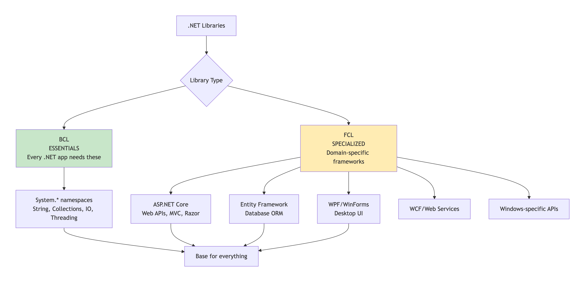
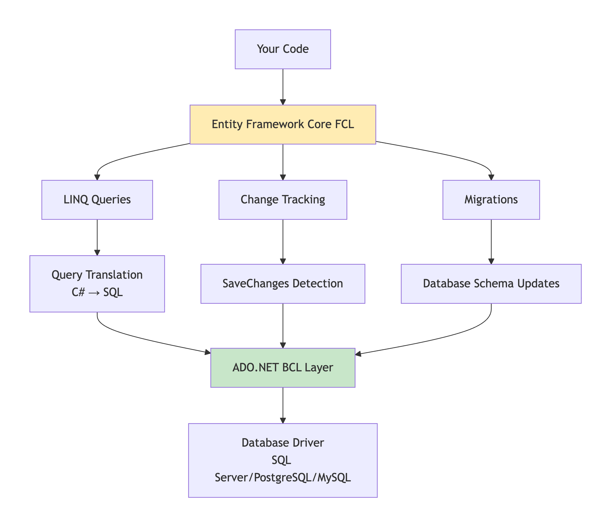
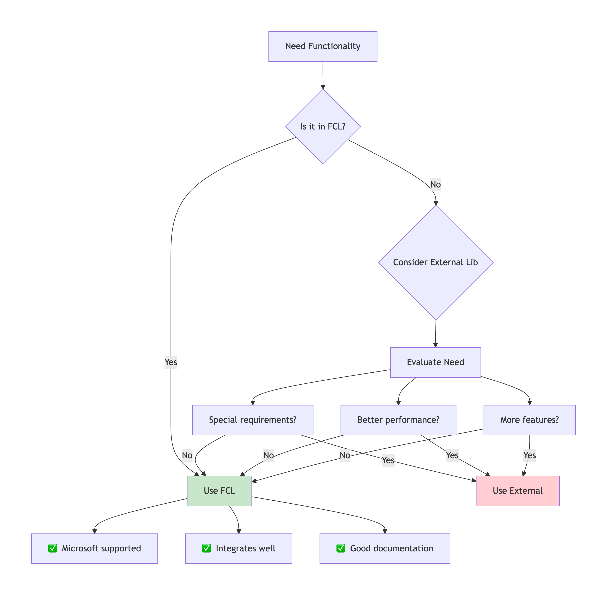

# FCL : Framework Class Library

The **Framework Class Library** or **FCL** provides the system functionality in the **.NET Framework** as it has various **classes**, **data types**, **interfaces**, etc. to perform multiple functions and build different types of applications such as desktop applications, web applications, mobile applications, etc.&#x20;

The **Framework Class Library** is integrated with the Common Language Runtime (**CLR**) of the .NET framework and is used by all the .NET languages such as **C#**, F#, Visual Basic .NET, etc.&#x20;

**Categories in the Framework Class Library**

The functionality of the Framework Class Library can be broadly divided into **three** categories i.e _utility features written in .NET_, _wrappers around the OS functionality_ and _frameworks_. These categories are not rigidly defined and there are many classes that may fit into more than one category.&#x20;

🎯 **BCL vs FCL: Clear Distinction**

**BCL = Core Foundation** | **FCL = Everything Else**

<figure><figcaption></figcaption></figure>

### 📦 **FCL Structure: Organized by Domain**

#### **Major FCL Components**

```
┌─────────────────────────────────────────┐
│ APPLICATION DOMAINS                     │
├─────────────────────────────────────────┤
│ WEB        │ DATA       │ UI      │ ... │
│ ASP.NET    │ EF Core    │ WPF     │     │
│ MVC        │ LINQ       │ WinForms│     │
│ Razor      │ ADO.NET    │ Xamarin │     │
├─────────────────────────────────────────┤
│ SHARED FCL LAYER                        │
│ • System.Drawing    • System.Net        │
│ • System.Xml        • System.Data       │
│ • System.Web        • System.Runtime    │
├─────────────────────────────────────────┤
│ BCL FOUNDATION                          │
│ • System.* core namespaces              │
└─────────────────────────────────────────┘
```

### 🔄 **How FCL Builds on BCL**

#### **Example:** [**ASP.NET**](https://asp.net/) **Core → Uses BCL Types**

```
// BCL provides:
// - System.IO (for file handling)
// - System.Collections (for data structures)
// - System.Threading.Tasks (for async)

// FCL (ASP.NET Core) builds on top:
public class WeatherController : ControllerBase
{
    [HttpGet]
    public async Task<ActionResult<Weather>> GetWeather(string city)
    {
        // BCL: Task<T>, List<T>, HttpClient, JsonSerializer
        // FCL: ControllerBase, HttpGet, ActionResult<T>
        
        var weather = await _service.GetWeatherAsync(city);
        return Ok(weather);  // FCL adds web-specific functionality
    }
}
```

### ⚡ **Key FCL Components & Their Purpose**

#### **1.** [**ASP.NET**](https://asp.net/) **Core (Web Development)**

```
// FCL provides HIGH-LEVEL web abstractions
public void ConfigureServices(IServiceCollection services)
{
    services.AddControllers();        // MVC pattern
    services.AddSwaggerGen();         // API documentation
    services.AddAuthentication();     // Security layer
    services.AddDbContext<AppDbContext>(); // EF Core integration
}

// What FCL adds over BCL:
// - HTTP request/response pipeline
// - Routing system
// - Model binding
// - Dependency injection container
// - Middleware architecture
```

#### **2. Entity Framework Core (Data Access)**

<figure><figcaption></figcaption></figure>


#### **3. Windows Desktop (WPF/WinForms)**

```csharp
// WPF uses BCL but adds UI framework
public partial class MainWindow : Window  // FCL type
{
    public MainWindow()
    {
        InitializeComponent();
        
        // BCL collections used by FCL
        var items = new ObservableCollection<string>(); // BCL
        
        // FCL data binding
        listBox.ItemsSource = items;  // FCL magic
        
        // FCL provides XAML, styling, animations, templates
    }
}
```

### 🔍 **When to Use FCL vs External Libraries**

#### **Decision Matrix**

<figure><figcaption></figcaption></figure>

#### **Specific Examples**

csharp

```
// ✅ USE FCL:
// Web APIs → ASP.NET Core
// Database ORM → Entity Framework Core  
// Desktop apps → WPF/WinForms (Windows only)
// XML processing → System.Xml
// JSON → System.Text.Json (modern) or Newtonsoft.Json (legacy)

// ✅ CONSIDER EXTERNAL:
// Advanced logging → Serilog/NLog (more features)
// PDF generation → iTextSharp/QuestPDF (FCL doesn't have)
// Advanced testing → xUnit/NUnit (more flexible than MSTest)
// Advanced DI → Autofac/SimpleInjector (more features)
// Specialized databases → MongoDB.Driver, Redis clients
```

### 📊 **FCL vs External: Pros & Cons**

#### **FCL Advantages**

text

```
✅ INTEGRATION: Works seamlessly with other .NET components
✅ SUPPORT: Microsoft-backed, long-term support
✅ UPDATES: Updated with .NET releases
✅ SECURITY: Regular security patches
✅ DOCUMENTATION: Extensive MSDN docs
✅ COMMUNITY: Large user base, many examples
```

#### **External Library Advantages**

text

```
✅ INNOVATION: Often first with new features
✅ FOCUS: Specialized, single-purpose libraries
✅ COMMUNITY-DRIVEN: Responds to user needs faster
✅ LIGHTWEIGHT: Can be smaller than full FCL component
✅ CHOICE: Multiple options for same problem
```

### 🚀 **Modern FCL Evolution**

#### **.NET Core/5+ Changes**

text

```
OLD (.NET Framework):
- Monolithic FCL (everything in one place)
- Windows-centric
- Legacy components (WebForms, WCF, Remoting)

NEW (.NET 5+):
- Modular (NuGet packages)
- Cross-platform
- Modernized (ASP.NET Core, EF Core)
- Trimmed legacy components
```

#### **Key FCL Packages Today**

text

```
Microsoft.AspNetCore.*     → Web development
Microsoft.EntityFrameworkCore.* → Database ORM
Microsoft.Extensions.*     → Configuration, Logging, DI
System.Text.Json          → JSON processing
System.Net.Http.Json      → HTTP + JSON integration
```

### ✅ **FCL Best Practices**

1. **Start with FCL** - It's usually good enough
2. **Know when to extend** - Use external libs for special needs
3. **Keep updated** - FCL gets better with each .NET version
4. **Understand dependencies** - FCL components depend on each other
5. **Consider platform** - Some FCL is Windows-only (WPF, WinForms)

### 🎯 **Quick Decision Guide**

```javascript
USE FCL WHEN:
- Building standard web APIs (ASP.NET Core)
- Basic database access (EF Core)
- Standard desktop apps (WPF on Windows)
- Common tasks (System.Text.Json for JSON)

USE EXTERNAL WHEN:
- FCL doesn't have the feature
- Need specialized functionality
- External lib has significantly better performance
- Open source customization needed
```

**Remember:** FCL is your extended toolbox. Use it for common tasks, but don't be afraid to reach for specialized tools (external libraries) when you need something specific.



