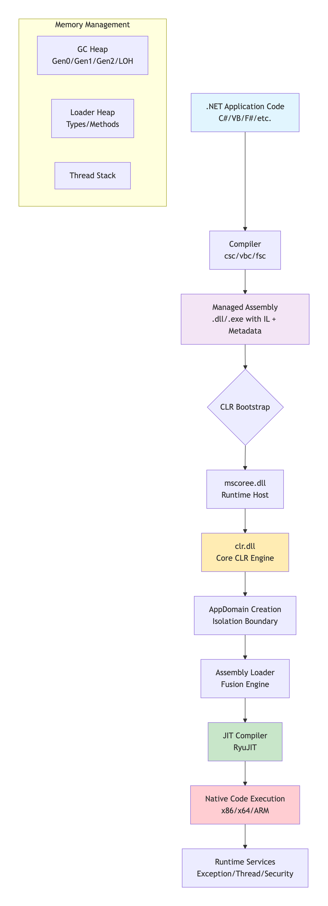
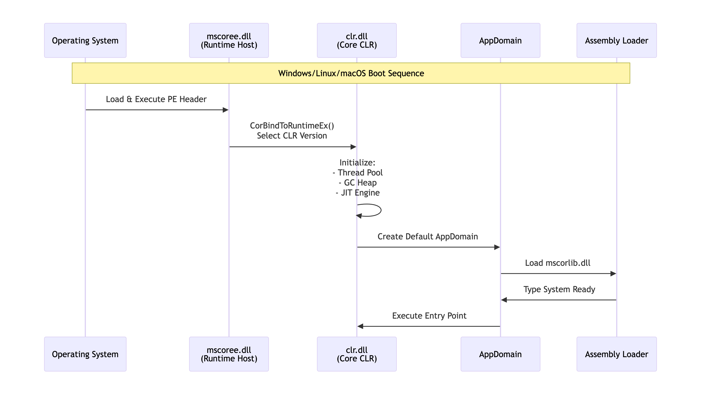
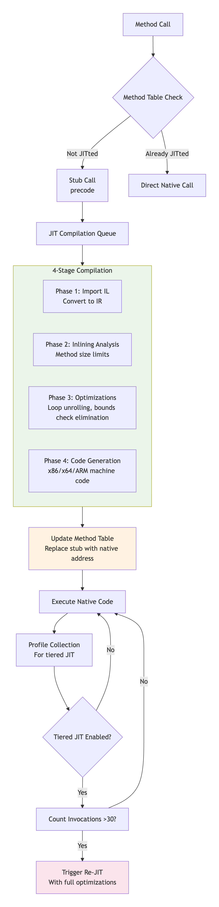
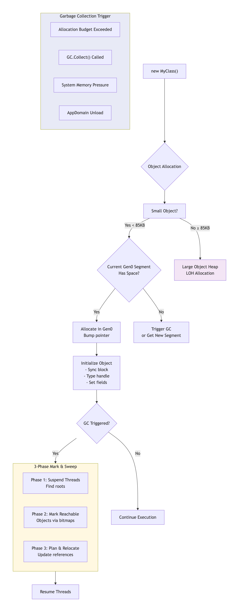
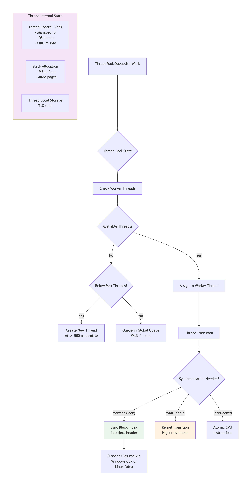
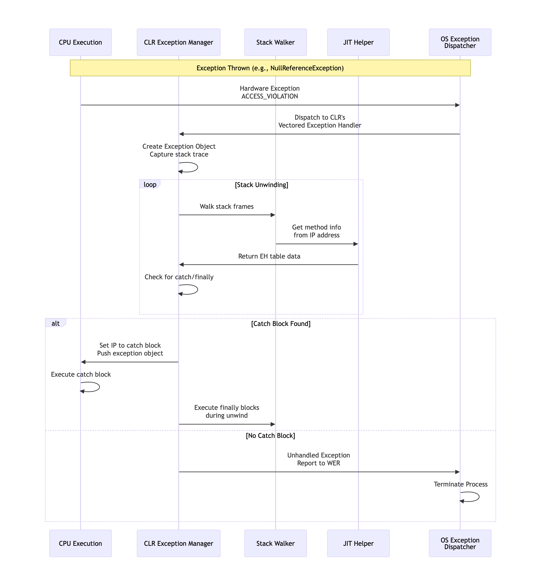
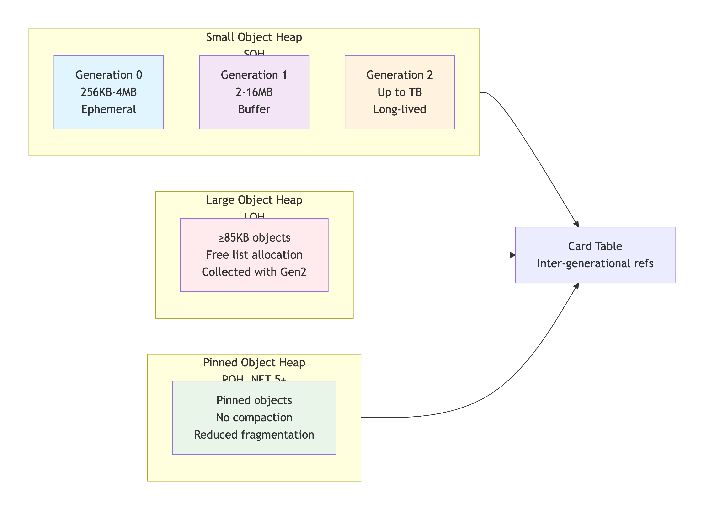

# 1.6 CLR : Common Language Runtime

***

<figure><figcaption></figcaption></figure>

The **Common Language Runtime (CLR)** is a component of the Microsoft .NET Framework that manages the execution of .NET applications. It is responsible for loading and executing the code written in various .NET programming languages, including C#, VB.NET, F#, and others.

When a [C#](https://www.geeksforgeeks.org/c-sharp/csharp-programming-language/) program is compiled, the resulting executable code is in an intermediate language called Common Intermediate Language (CIL) or Microsoft Intermediate Language (MSIL). This code is not machine-specific, and it can run on any platform that has the CLR installed. When the CIL code is executed, the CLR compiles it into machine code that can be executed by the processor.

## CLR Internal Workflow & Execution Pipeline

### 🎯 CLR Architecture Overview

<div data-with-frame="true"><figure><figcaption></figcaption></figure></div>

### 🔄 Detailed CLR Execution Workflow

#### **Phase 1: CLR Startup & Initialization**

<figure><figcaption></figcaption></figure>

#### **Phase 2: JIT Compilation Process**

<figure><figcaption></figcaption></figure>

#### **Phase 3: Memory Management & Garbage Collection**

<figure><figcaption></figcaption></figure>

#### **Phase 4: Threading & Synchronization**

<figure><figcaption></figcaption></figure>

**Phase 5: Exception Handling Workflow**

<figure><figcaption></figcaption></figure>

🏗️ **CLR Internal Data Structures**

#### **Object Layout in Memory**<br>

```javascript
Object Header (8 bytes on 64-bit)
┌─────────────────────────────────────────┐
│ Sync Block Index     │  Type Handle     │
│ (lock/wait/hash)    │ (MethodTable*)   │
├─────────────────────────────────────────┤
│         Instance Fields                 │
│ (alignment padding as needed)           │
└─────────────────────────────────────────┘

Method Table (Type-specific)
┌─────────────────────────────────────────┐
│ EEClass*           │ Interface Map      │
├─────────────────────────────────────────┤
│ Method Slots (virtual method pointers)  │
│ - ToString()                            │
│ - GetHashCode()                         │
│ - Equals()                              │
│ - Finalize()                            │
│ - [User virtual methods...]             │
└─────────────────────────────────────────┘
```

#### **GC Heap Organization**

<figure><figcaption></figcaption></figure>

### ⚡ **Performance Optimizations**

#### **JIT Optimizations Applied**

| Optimization                 | Description                      | Impact             |
| ---------------------------- | -------------------------------- | ------------------ |
| **Inlining**                 | Small methods copied into caller | 10-20% speedup     |
| **Devirtualization**         | Virtual calls → direct calls     | 5-15% speedup      |
| **Bounds Check Elimination** | Remove array bounds checks       | 2-10% speedup      |
| **Loop Unrolling**           | Duplicate loop body              | Cache optimization |
| **Dead Code Elimination**    | Remove unused code               | Size reduction     |
| **Constant Folding**         | Pre-compute constants            | Compile-time calc  |

#### **Tiered Compilation States**

```
Method Lifecycle:
State 0: Not JITted          → Stub points to prestub
State 1: Tier 0 JIT          → Quick, unoptimized
State 2: Tier 1 JIT          → Fully optimized
State 3: Replaced            → Optimized version ready
State 4: Has Precode         → For virtual dispatch
```

### 🔧 **CLR Configuration & Tuning**

#### **Key Environment Variables**

bash

```javascript
# JIT Behavior
export COMPlus_TieredCompilation=1           # Enable tiered JIT
export COMPlus_TC_QuickJitForLoops=1         # JIT loops quickly
export COMPlus_ReadyToRun=1                  # Use pre-compiled code

# GC Settings
export COMPlus_gcServer=1                    # Server GC mode
export COMPlus_GCHeapCount=8                 # GC threads for server
export COMPlus_GCLOHThreshold=85000          # LOH threshold

# Thread Pool
export COMPlus_ThreadPool_ForceMinWorkerThreads=4
export COMPlus_ThreadPool_ForceMaxWorkerThreads=64
```

#### **Diagnostic Tools**

text

```
1. PerfView       : GC/JIT/Thread analysis
2. dotnet-counters: Real-time metrics
3. dotnet-trace   : Event collection
4. dotnet-dump    : Memory dump analysis
5. SOS Debugger   : Deep CLR inspection
```

### 📊 **Real-World Execution Example**

```c#
// Sample code showing CLR internals
public class Program
{
    public static void Main()
    {
        // 1. JIT compiles Main() on first call
        var calculator = new Calculator();
        
        // 2. newobj IL instruction triggers:
        //    - GC check for Gen0 space
        //    - Allocate memory (size = Calculator instance)
        //    - Initialize object header
        //    - Call constructor
        
        // 3. Method call triggers JIT if not compiled
        int result = calculator.Add(5, 10);
        
        // 4. Integer allocation goes to stack (value type)
        // 5. Return value placed in register/stack
    }
}

public class Calculator
{
    // Method table created when type loaded
    // Virtual method slots allocated
    
    public int Add(int a, int b)
    {
        // JIT compiles this when first called
        // May be inlined if small enough
        return a + b;
    }
}
```

### 🎯 **Key Takeaways**

1. **CLR is a Virtual Machine** - Not just an interpreter, but a full runtime with JIT compilation
2. **Layered Optimization** - From quick JIT to fully optimized based on usage
3. **Managed Memory** - Automatic allocation/collection with generational GC
4. **Security Sandbox** - AppDomains (legacy) and assembly isolation
5. **Cross-Platform** - Same CLR concepts on Windows/Linux/macOS
6. **Self-Tuning** - Adaptive based on application behavior



