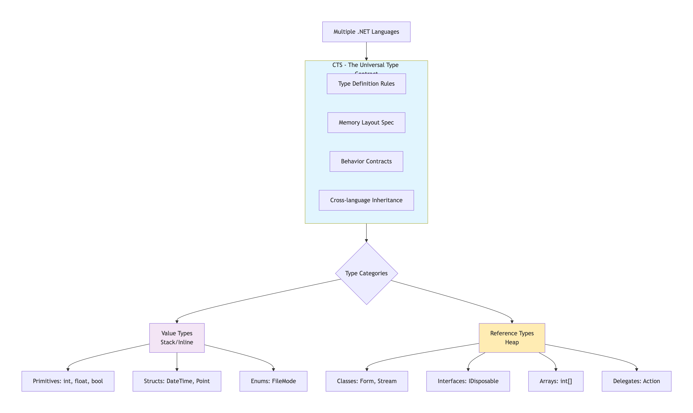
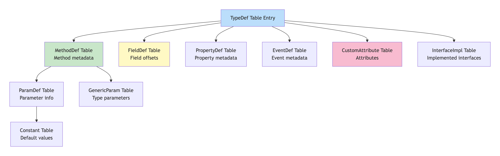
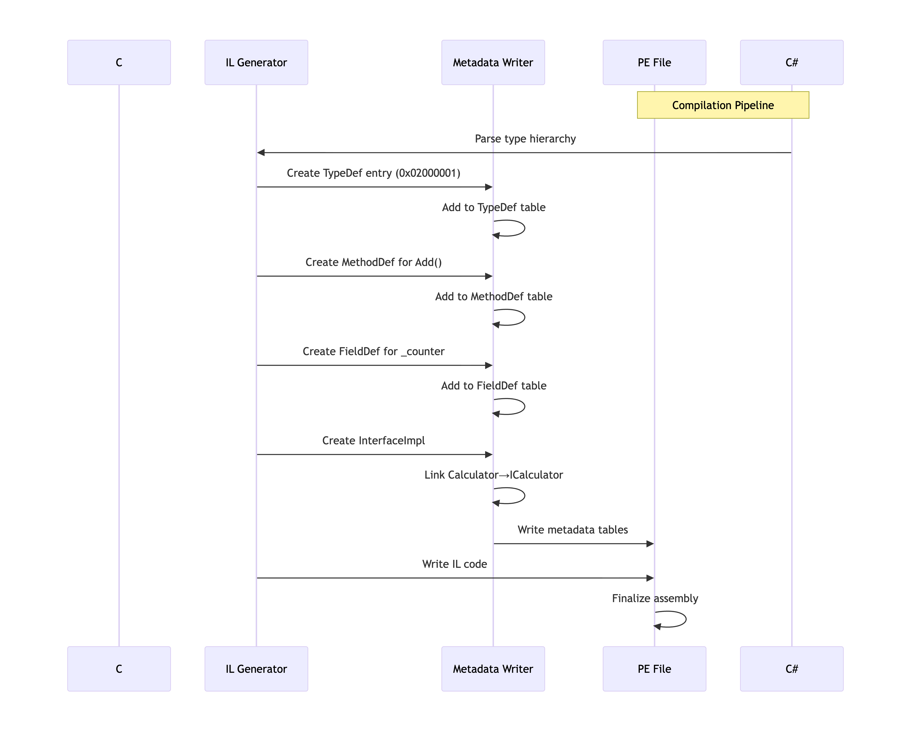
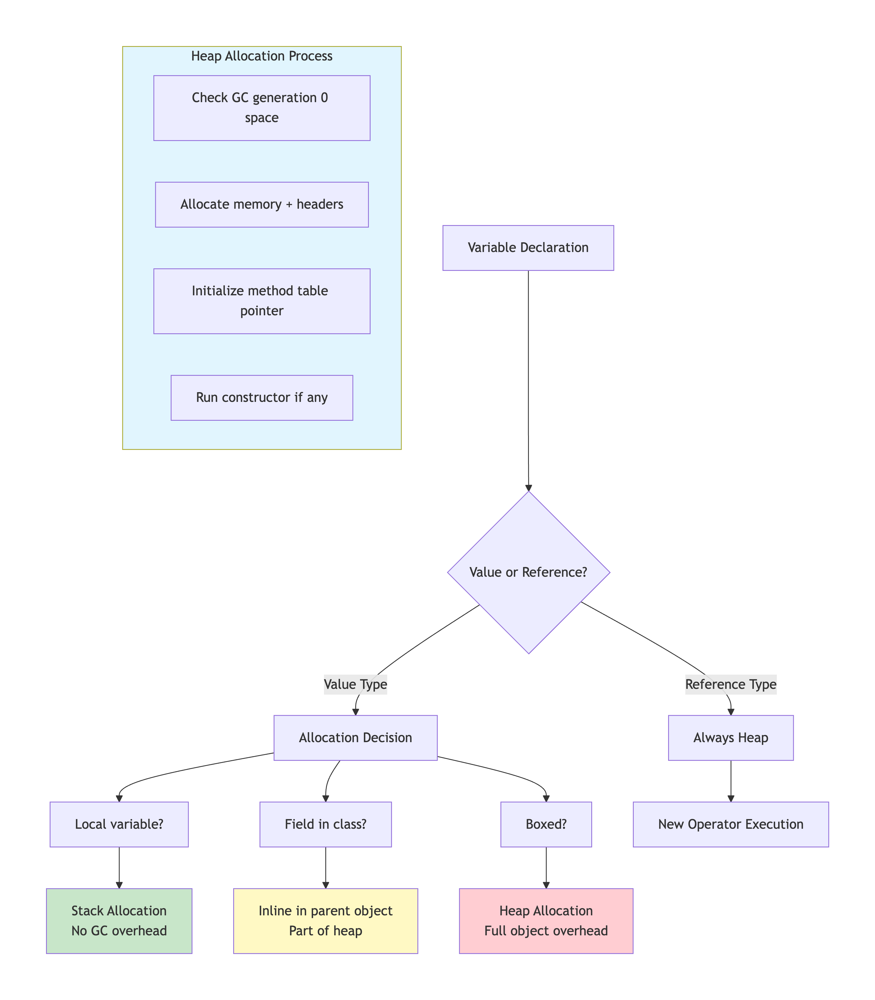
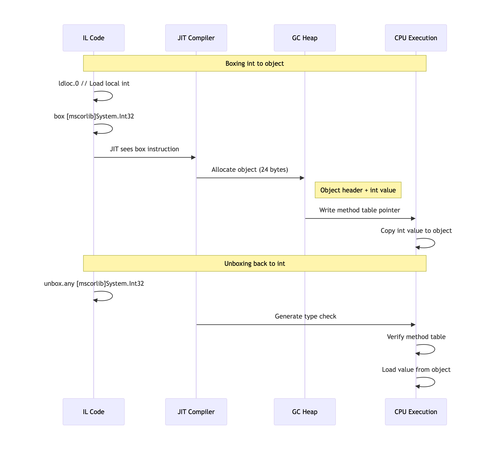
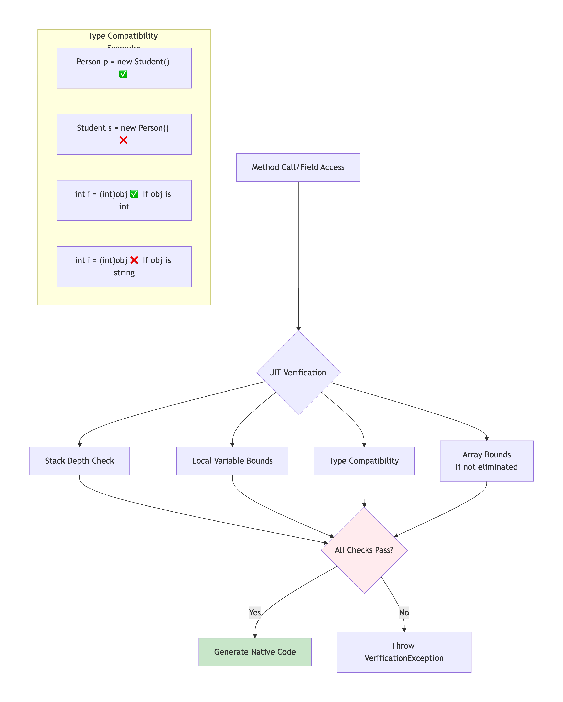

# 1.7 CTS (Common Type System)

<figure><figcaption></figcaption></figure>

### 🎯 **What is CTS? The Big Picture**

<figure><figcaption></figcaption></figure>

### 🔄 **CTS Internal Architecture**

#### **Type Metadata Representation**

<figure><figcaption></figcaption></figure>

#### **Memory Layout Differences**

csharp

```
// VALUE TYPE (struct) - Memory Layout
public struct Point
{
    public int X;    // Offset: 0, Size: 4
    public int Y;    // Offset: 4, Size: 4
    // Total size: 8 bytes, inline storage
}

// REFERENCE TYPE (class) - Memory Layout  
public class Person
{
    // Object Header (8/16 bytes)
    // - SyncBlockIndex (4/8 bytes)
    // - TypeHandle/MethodTable* (4/8 bytes)
    
    public string Name;    // Reference (8 bytes on 64-bit)
    public int Age;        // Offset: 16, Size: 4
    // Padding to 8-byte boundary
    // Total overhead: 24+ bytes
}
```

### 🚀 **From Source Code to CTS Execution: Complete Flow**

#### **Step 1: Type Definition in Source**

csharp

```csharp
// C# Source
public class Calculator : ICalculator
{
    private int _counter = 0;
    
    public int Add(int a, int b)
    {
        Interlocked.Increment(ref _counter);
        return a + b;
    }
}

public interface ICalculator
{
    int Add(int a, int b);
}
```

#### **Step 2: Compiler to Metadata Transformation**

<figure><figcaption></figcaption></figure>

#### **Step 3: Metadata Tables Internal Structure**

text

```
TypeDef Table (Token: 0x02000001)
┌──────────────┬─────────────────────────────────┐
│ Field        │ Value                           │
├──────────────┼─────────────────────────────────┤
│ Flags        │ tdClass | tdPublic              │
│ Name         │ "Calculator"                    │
│ Namespace    │ ""                              │
│ Extends      │ 0x01000001 (System.Object)      │
│ FieldList    │ 0x04000001 (points to _counter) │
│ MethodList   │ 0x06000001 (points to Add)      │
└──────────────┴─────────────────────────────────┘

MethodDef Table (Token: 0x06000001)
┌──────────────┬─────────────────────────────────┐
│ RVA          │ 0x00002050 (IL code location)   │
│ ImplFlags    │ cil | managed                   │
│ Flags        │ mdPublic | mdVirtual            │
│ Name         │ "Add"                           │
│ Signature    │ 0x11000001 (int, int → int)     │
│ ParamList    │ 0x08000001 (parameter a)        │
└──────────────┴─────────────────────────────────┘
```

### ⚡ **Value Types vs Reference Types: Deep Dive**

#### **Memory Allocation & Lifetime**

<figure><figcaption></figcaption></figure>

#### **Real Example with Memory Snapshots**

```csharp
public class Program
{
    // Static field - goes in Loader Heap (Type object)
    public static DateTime AppStartTime;
    
    public void Run()
    {
        // Local value types - STACK
        int localInt = 42;           // Stack: 4 bytes
        Point localPoint = new Point(10, 20); // Stack: 8 bytes
        
        // Reference type - HEAP
        Person person = new Person(); // Heap: 24+ bytes
        
        // Value type field - INLINE in heap object
        // person.Age is inside Person instance
        
        // Array of value types - HEAP (but values inline)
        Point[] points = new Point[10]; 
        // Array object + 10*8 bytes inline in array
        
        // Boxing creates HEAP object
        object boxedInt = localInt;  // New heap object created
    }
}

public struct Point 
{ 
    public int X, Y; 
    public Point(int x, int y) { X = x; Y = y; }
}

public class Person 
{ 
    public string Name;   // Reference
    public int Age;       // Value type inline (4 bytes)
    public DateTime BirthDate; // Value type inline (8 bytes)
}
```

#### **Boxing/Unboxing Internal Process**

<figure><figcaption></figcaption></figure>

### 🔗 **Language Interoperability in Action**

#### **C# →** [**VB.NET**](https://vb.net/) **→ F# Type Sharing**

```csharp
// C# Definition
[Serializable]
public class DataModel
{
    public string Name { get; set; }
    public List<int> Values { get; } = new List<int>();
    
    public void AddValue(int value) => Values.Add(value);
}
```

```vb
' VB.NET Consumption
Imports System

Module Program
    Sub Main()
        ' CTS ensures compatibility
        Dim model As New DataModel()
        model.Name = "VB.NET"
        model.AddValue(42)
        
        ' Same type, different syntax
        For Each value As Integer In model.Values
            Console.WriteLine(value)
        Next
    End Sub
End Module
```

```fsharp
// F# Consumption
open System

let processModel (model: DataModel) =
    // Same CTS type, F# syntax
    model.Name <- "F#"
    model.AddValue(99)
    
    // Pattern matching works across languages
    match model.Values with
    | [] -> printfn "Empty"
    | values -> printfn "Count: %d" values.Count
```

#### **Metadata Cross-Language Signature**

```javascript
Method Signature in Metadata (Blob)
AddValue method signature:
┌──────────────┬─────────────────────────┐
│ Calling Conv │ DEFAULT (instance call) │
│ Param Count  │ 1                       │
│ Return Type  │ ELEMENT_TYPE_VOID       │
│ Param 1      │ ELEMENT_TYPE_I4 (int)   │
└──────────────┴─────────────────────────┘

Property Metadata:
Name property:
┌────────────────┬──────────────────────┐
│ Getter         │ 0x06000002           │
│ Setter         │ 0x06000003           │
│ Backing Field  │ <Name>k__BackingField│
└────────────────┴──────────────────────┘
```

### 🛡️ **Type Safety Guarantees & Verification**

#### **Runtime Type Safety Checks**

<figure><figcaption></figcaption></figure>

#### **Generic Type Safety at Runtime**

```csharp
public class Repository<T> where T : IEntity
{
    private List<T> _items = new List<T>();
    
    public void Add(T item)
    {
        // JIT creates specialized version per value type
        // Shared version for reference types
        _items.Add(item);
    }
}

// JIT Compilation Process:
// Repository<int> → Error: int doesn't implement IEntity
// Repository<Customer> → Specialized code generated
// Repository<Product> → Reuses reference type version
```

### 📊 **CTS Type Hierarchy & Relationships**

#### **Complete Type System Map**

<figure><figcaption></figcaption></figure>

#### **Interface Implementation Layout**

```csharp
public interface IDrawable { void Draw(); }
public interface IResizable { void Resize(int percent); }

public class Shape : IDrawable, IResizable
{
    // Method Table Layout:
    // [0]: ToString (Object)
    // [1]: GetHashCode (Object)
    // [2]: Equals (Object)
    // [3]: Finalize (Object)
    // [4]: Draw (IDrawable slot)
    // [5]: Resize (IResizable slot)
    // [6]: Type-specific methods...
    
    public void Draw() { /* Implementation */ }
    public void Resize(int percent) { /* Implementation */ }
}

// Interface Map in Metadata:
// Shape → [IDrawable, IResizable]
// Each interface has its own vtable slice
```

### ⚡ **Performance Implications & Optimizations**

#### **Value Type Performance Characteristics**

```csharp
// Benchmark: Value vs Reference types
public struct Vector3 // 12 bytes
{
    public float X, Y, Z;
}

public class Vector3Class // 24+ bytes
{
    public float X, Y, Z;
}

public void ProcessVectors()
{
    // Array of 1 million vectors:
    Vector3[] valueArray = new Vector3[1_000_000]; 
    // Memory: ~12MB contiguous
    
    Vector3Class[] refArray = new Vector3Class[1_000_000];
    // Memory: ~24MB + 1M*24+ = ~48MB+ scattered
    
    // Iteration performance:
    for (int i = 0; i < valueArray.Length; i++)
    {
        // CPU cache friendly - sequential access
        valueArray[i].X = i;
    }
    
    for (int i = 0; i < refArray.Length; i++)
    {
        // Cache misses likely - pointer chasing
        refArray[i].X = i;
    }
}
```

#### **Boxing Overhead Analysis**

```csharp
public void BoxingDemo()
{
    int count = 1000000;
    
    // WITHOUT BOXING (Value type in struct)
    var point = new Point(10, 20);
    ProcessPoint(point); // Pass by value
    
    // WITH BOXING
    object boxed = point; // Heap allocation!
    
    // Boxing in collections
    ArrayList oldList = new ArrayList(); // Boxes everything!
    oldList.Add(42);                     // BOX
    oldList.Add("text");                 // No box (reference)
    
    List<int> genericList = new List<int>(); // No boxing!
    genericList.Add(42);                     // No box
    
    // Unboxing cost
    int unboxed = (int)oldList[0]; // Type check + memory read
}
```

### 🔧 **Advanced CTS Features**

#### **Custom Value Types with Special Behavior**

```csharp
// Custom value type with operator overloading
public struct Money : IEquatable<Money>, IComparable<Money>
{
    private readonly decimal _amount;
    private readonly string _currency;
    
    // CTS ensures:
    // 1. Default constructor (zero-init)
    // 2. Stack/inline allocation
    // 3. Copy semantics
    
    public static Money operator +(Money a, Money b)
    {
        if (a._currency != b._currency)
            throw new InvalidOperationException("Currency mismatch");
        return new Money(a._amount + b._amount, a._currency);
    }
    
    // Interface implementations work on value types
    public bool Equals(Money other) => 
        _amount == other._amount && _currency == other._currency;
}

// Nullable value types (special CTS support)
int? nullableInt = null; // Actually: Nullable<int>
DateTime? date = DateTime.Now;
```

#### **Type Forwarding & Versioning**

```csharp
// Assembly A v1.0
namespace Company.Legacy
{
    public class OldModel { /* ... */ }
}

// Assembly A v2.0 - Type moved to different assembly
[assembly: TypeForwardedTo(typeof(Company.New.NewModel))]

// Assembly B (consumes A)
// Loads Company.Legacy.OldModel
// Runtime finds TypeForwardedTo attribute
// Automatically loads from new assembly
```

### 🎯 **Real-World CTS Application: Serialization**

```csharp
public class JsonSerializer
{
    public string Serialize(object obj)
    {
        var type = obj.GetType(); // CTS provides runtime type info
        
        if (type.IsValueType)
        {
            // Handle value types differently
            return SerializeValueType(obj, type);
        }
        
        // Use reflection (based on CTS metadata)
        var properties = type.GetProperties();
        foreach (var prop in properties)
        {
            var value = prop.GetValue(obj);
            
            // CTS ensures type compatibility
            if (value == null) continue;
            
            var valueType = value.GetType();
            if (valueType.IsPrimitive)
            {
                // Handle primitives efficiently
            }
            else if (valueType == typeof(string))
            {
                // Handle strings
            }
            // Recursive serialization for complex types
        }
    }
}
```

### 📈 **CTS in .NET Ecosystem**

#### **Cross-Cutting Concerns**

```javascript
CTS Enables:
1. Serialization (JSON, XML, Binary)
2. Object-Relational Mapping (EF Core)
3. Dependency Injection
4. Reflection and Dynamic Programming
5. Debugger and Profiler Tools
6. Cross-language debugging
7. LINQ Expression Trees
8. Dynamic Language Runtime (DLR)
```

#### **Evolution of CTS**

```javascript
.NET Framework 1.0-2.0:
- Basic value/reference type system
- Limited generics support
- Boxing performance issues

.NET Framework 4.0:
- Co/Contravariance in generics
- Dynamic language support
- Tuple types (System.Tuple)

.NET Core/5+:
- Span<T> for stack allocation
- Ref structs
- Records (C# 9+)
- Native-sized integers (nint, nuint)
```

### ✅ **Key Takeaways**

1. **CTS is the Contract** - Defines how types behave across all .NET languages
2. **Two Fundamental Categories** - Value types (stack/inline) vs Reference types (heap)
3. **Metadata-Driven** - Every type fully described in assembly metadata
4. **Cross-Language** - C#, [VB.NET](https://vb.net/), F# all compile to same CTS types
5. **Safety First** - Runtime verification prevents type violations
6. **Performance Aware** - Different optimizations for value vs reference types
7. **Evolutionary** - New features added while maintaining compatibility

The CTS is the bedrock of .NET's "write once, run anywhere" promise - it ensures that code written in any .NET language can interoperate seamlessly while maintaining type safety and performance characteristics.



