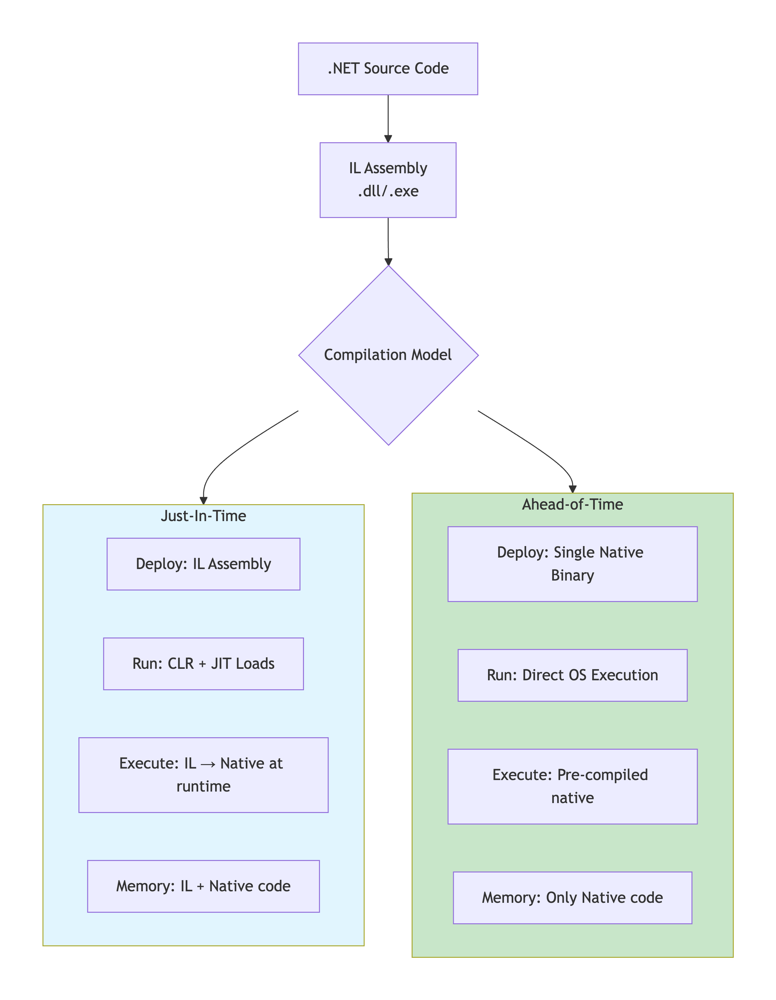
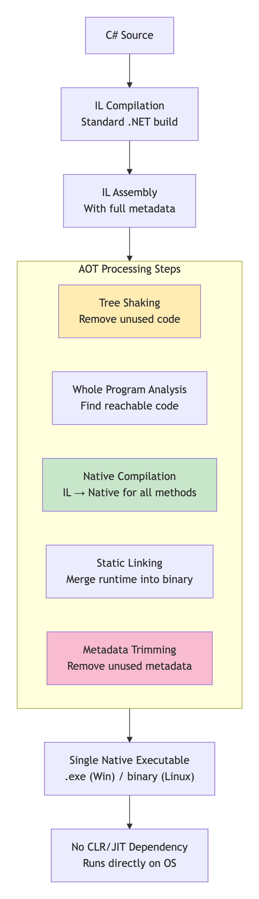
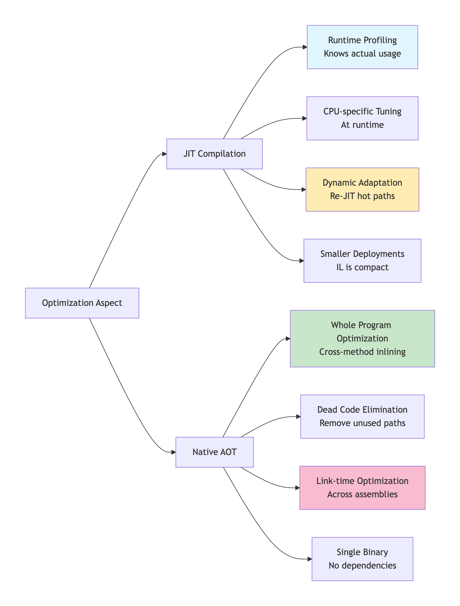
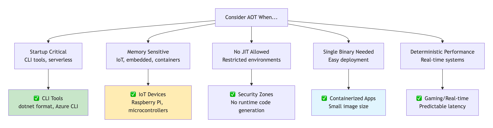
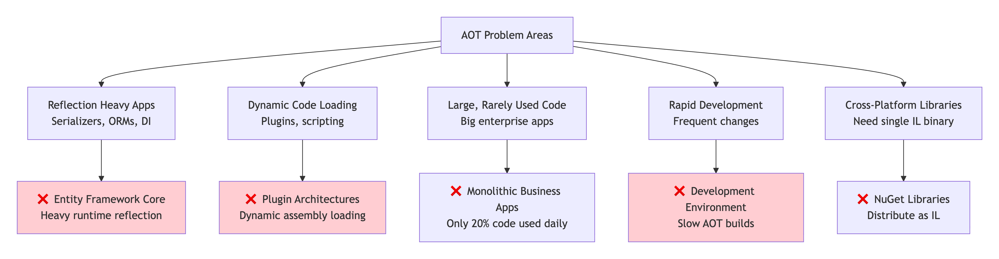
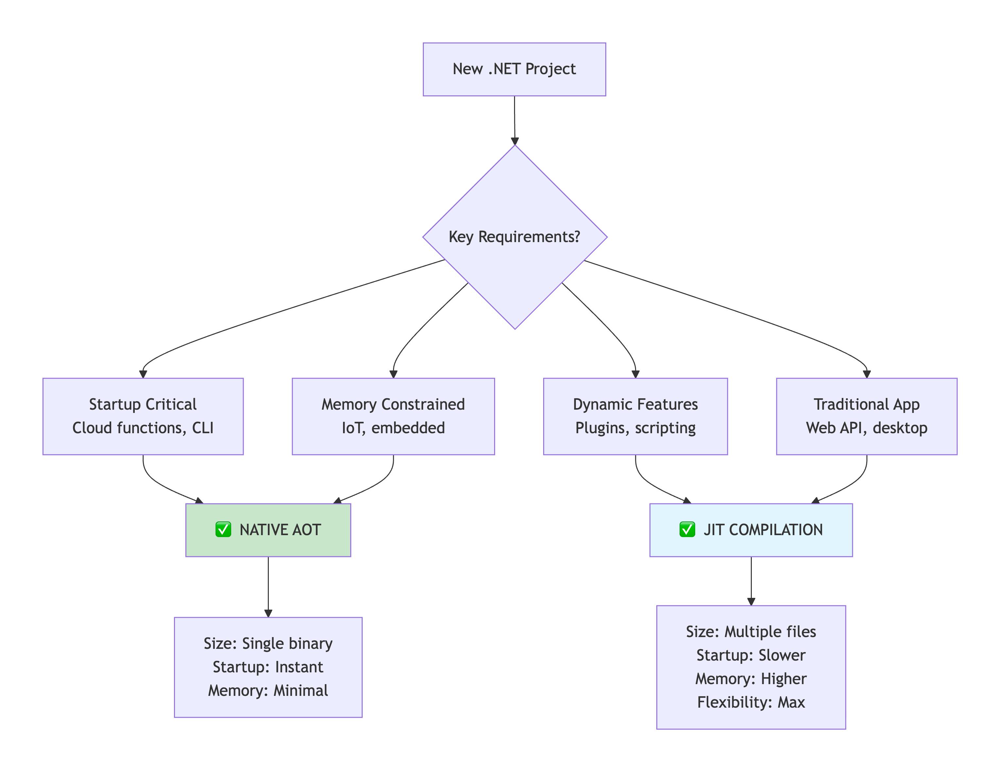

# Native AOT (Ahead-of-Time)

In .NET, **AOT** (Ahead-Of-Time) compilation is a process that converts Intermediate Language (**IL**) into native **machine code** _before_ the application runs, unlike **JIT** (Just-In-Time) which does it at runtime, resulting in faster startup, smaller memory footprints, simpler deployment (often self-contained executables), and suitability for restricted environments like serverless or containers, though it sacrifices some flexibility and portability.

### <mark style="color:blue;">How it works</mark>

* **Traditional .NET (JIT):** C# code -> IL -> JIT compiles IL to native code at runtime.
* **AOT .NET:** C# code -> IL -> AOT compiles IL to native code at build/publish time, creating a single executable.&#x20;

### 🎯 **Native AOT vs JIT: The Fundamental Difference**

<figure><figcaption></figcaption></figure>

### 🔄 **Native AOT Compilation Pipeline**

#### **Complete AOT Build Process**

<figure><figcaption></figcaption></figure>

### 📊 **JIT vs AOT: Head-to-Head Comparison**

#### **Performance Characteristics**

text

```
JIT COMPILATION:
✅ Startup: Slow (JIT overhead)
✅ Throughput: Excellent (runtime optimization)
✅ Memory: High (IL + Native + JIT)
✅ Size: Smaller (IL is compact)

NATIVE AOT:
✅ Startup: Instant (pre-compiled)
✅ Throughput: Good (but static)
✅ Memory: Low (only native code)
✅ Size: Larger (native code + runtime)
```

#### **Optimization Differences**

<figure><figcaption></figcaption></figure>

### ✅ **When Native AOT IS Useful**

#### **Perfect Use Cases**

<figure><figcaption></figcaption></figure>

#### **Real-World AOT Success Stories**

```csharp
// Example: AWS Lambda (.NET 7+ with Native AOT)
public class Function
{
    // With JIT: ~500ms cold start
    // With AOT: ~50ms cold start (10x faster!)
    
    public string Handler(string input)
    {
        return $"Processed: {input}";
    }
}

// Example: IoT Device
public class SensorReader
{
    // Device: 128MB RAM
    // JIT: ~50MB (CLR + JIT + IL)
    // AOT: ~8MB (native binary only)
    
    public void ReadAndSend()
    {
        // Runs on constrained devices
    }
}
```

### ❌ **When Native AOT Is NOT Recommended**

#### **AOT Limitations & Challenges**

<figure><figcaption></figcaption></figure>

#### **Technical Limitations**

```csharp
// Things that BREAK with Native AOT:

// 1. Runtime Reflection
typeof(SomeType).GetMethod("MethodName");  // ❌ Method might be trimmed
Activator.CreateInstance(type);             // ❌ Type might not exist

// 2. Dynamic Code Generation
var method = new DynamicMethod(...);        // ❌ No JIT available
Expression.Lambda<Func<int>>(...).Compile(); // ❌ Can't compile at runtime

// 3. Unconstrained Generics
void Process<T>(T item) where T : new()
{
    new T();  // ❌ Can't instantiate unknown T
    typeof(T).GetProperties(); // ❌ Reflection on generic parameter
}

// 4. Late-bound COM
dynamic excel = Activator.CreateInstance(comType); // ❌ Runtime binding
```

### ⚡ **Native AOT Optimization Details**

#### **Tree Shaking: Removing Unused Code**

```
BEFORE AOT (Full Assembly):
┌─────────────────────────────────┐
│ All Types (100%)                │
│ • Used types (20%)              │
│ • Unused types (80%)            │
│ All Methods (100%)              │
│ • Used methods (15%)            │
│ • Unused methods (85%)          │
└─────────────────────────────────┘

AFTER AOT TREE SHAKING:
┌─────────────────────────────────┐
│ Only Used Code (20-30%)         │
│ • Essential types kept          │
│ • Dead code eliminated          │
│ • Metadata trimmed              │
│ Size: 70-80% reduction          │
└─────────────────────────────────┘
```

#### **Link-time Optimizations**

```csharp
// Cross-assembly inlining becomes possible
// Assembly A
public class Service
{
    public int Process() => Helper.Compute() * 2;
}

// Assembly B  
public static class Helper
{
    public static int Compute() => 42;
}

// AOT can inline across assembly boundaries:
// Service.Process() becomes: return 84;
// No method call, no assembly boundary crossing
```

### 🔧 **AOT Configuration & Trimming**

#### **Controlling What Gets Trimmed**

```xml
<!-- Project.csproj -->
<PropertyGroup>
  <PublishAot>true</PublishAot>
  <TrimMode>full</TrimMode>
</PropertyGroup>

<!-- rd.xml file to preserve code -->
<Directives>
  <Application>
    <!-- Keep this type no matter what -->
    <Type Name="MyApp.CriticalType" Dynamic="Required All" />
    
    <!-- Keep all methods on this type -->
    <Type Name="MyApp.Serializer">
      <Method Name="*" />
    </Type>
    
    <!-- Keep assembly for reflection -->
    <Assembly Name="Newtonsoft.Json" Dynamic="Required All" />
  </Application>
</Directives>
```

#### **Build Output Comparison**

```
JIT PUBLISH:
myapp.dll                    (IL + Metadata)
myapp.runtimeconfig.json     (Runtime settings)
hostfxr.dll                  (CLR host)
clrjit.dll                   (JIT compiler)
coreclr.dll                  (CLR runtime)
+ 50+ other DLLs

NATIVE AOT PUBLISH:
myapp.exe                    (Single native binary)
myapp.pdb                    (Debug symbols)
That's it! No dependencies.
```

### 📈 **Performance Benchmarks**

#### **Cold Start Comparison**

```
Scenario: HTTP API with 10 endpoints

JIT (.NET 8):
├── Process start: 0ms
├── CLR initialize: 120ms
├── Assembly load: 80ms  
├── First request (JIT): 300ms
└── Total cold start: 500ms

NATIVE AOT (.NET 8):
├── Process start: 0ms
├── Native execution: 5ms
├── First request: 20ms
└── Total cold start: 25ms (20x faster!)
```

#### **Memory Footprint**

```
Simple Console App (Hello World):

JIT Deployment:
• Total files: 65 files
• Total size: 150MB
• Runtime memory: 60MB

Native AOT Deployment:
• Total files: 1 file
• Total size: 8MB (98% smaller!)
• Runtime memory: 4MB (93% less!)
```

### 🛠️ **Migration Guide: JIT → AOT**

#### **Step-by-Step Conversion**

```csharp
// BEFORE (JIT-compatible)
public class DataProcessor
{
    // Problem: Uses reflection
    public T Process<T>(string json)
    {
        return JsonConvert.DeserializeObject<T>(json);
    }
}

// AFTER (AOT-compatible)
public class DataProcessor
{
    // Solution 1: Use source generators
    [JsonSourceGenerationOptions(/*...*/)]
    [JsonSerializable(typeof(Person))]
    [JsonSerializable(typeof(Order))]
    private partial class AppJsonContext : JsonSerializerContext
    {
    }
    
    // Solution 2: Use generic constraints
    public T Process<T>(string json) where T : IJsonParsable<T>, new()
    {
        return T.Parse(json);  // Static interface method
    }
}
```

### ✅ **Decision Framework: JIT or AOT?**

<figure><figcaption></figcaption></figure>

### 🎯 **Key Takeaways**

```
NATIVE AOT IS:
• Build-time compilation (IL → Native)
• Single binary, no dependencies  
• Instant startup, small memory
• Limited by static analysis

USE AOT WHEN:
✓ Startup time critical
✓ Memory constrained
✓ Single binary needed
✓ No runtime code generation

AVOID AOT WHEN:
✗ Heavy reflection usage
✗ Dynamic code loading  
✗ Rapid development cycles
✗ Large, infrequently used codebases

JIT VS AOT TRADE-OFF:
JIT: Runtime flexibility, adaptive optimization
AOT: Deployment simplicity, predictable performance
```

**Bottom Line:** Native AOT is revolutionary for deployment and startup scenarios, but JIT remains king for developer productivity and runtime adaptability. Choose based on your specific deployment constraints and runtime needs.
